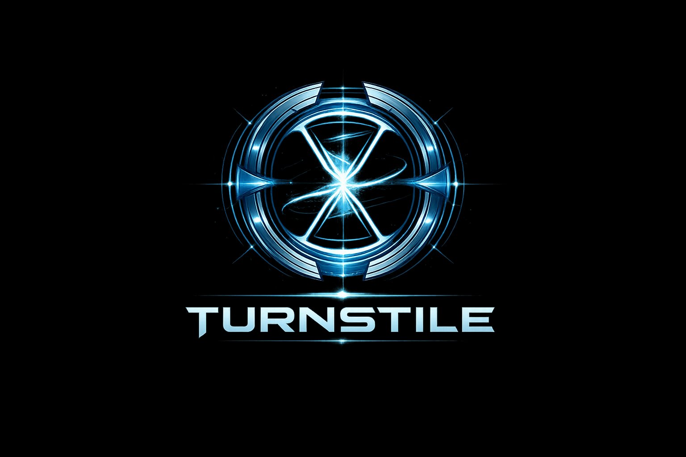

# 🌀 TURNSTILE

### A Bayesian Temporal Inversion Engine — Proving Why It Must Happen

<p align="center">
  
</p>

<p align="center">
  <b>MiroFish predicts WHAT happens. Turnstile proves WHY it must.</b>
</p>

<p align="center">
  <a href="https://baesy2.github.io/turnstile/">🔮 Live Demo</a> · 
  <a href="#quick-start">⚡ Quick Start</a> · 
  <a href="MATH.md">📐 Math Foundation</a> · 
  <a href="#how-it-works">🧠 How It Works</a>
</p>

<p align="center">
  
  
  
  
  
</p>

---

## What is TURNSTILE?

Most prediction tools ask: **"What will happen?"** (forward simulation)

TURNSTILE asks the opposite: **"What HAD to be true for this outcome?"** (backward inversion)

```
Input:  "Trump announces 60% tariffs on China"
Output: "Tariffs get negotiated to 30% within 90 days — US agricultural 
         lobby exerts decisive pressure as soybean exports collapse 40%."

         ⚡ TURNSTILE POINT: US farm lobby launches campaign (Week 3-4)
         ❌ WRONG IF: Trump approval stays above 48% despite tariffs
         🔍 HIDDEN: China pre-ordered Australian soybeans for 6 months
```

**Not a range. Not a hedge. A specific, falsifiable prediction with the causal mechanism.**

---

## How It Works

```
You write a scenario
        ↓
   [LLM: Build DAG]         ← 1 API call ($0.02)
        ↓
   [Forward Pass]            ← numpy, 0 LLM, ~5ms
   P(j) = 1 - ∏(1 - A[i,j] × td × P(i))
        ↓
   [Bayesian Inversion]      ← numpy, 0 LLM, ~8ms  
   P(A|B) = P(B|A) × P(A) / P(B)
        ↓
   [Entropy Gradient]        ← numpy, 0 LLM, ~2ms
   ∇H = H_fwd - H_inv
   Find node where ∇H ≈ 0   → TURNSTILE POINT
        ↓
   [Monte Carlo ×500]        ← numpy, 0 LLM, ~20ms
        ↓
   [LLM: Write Verdict]     ← 1 API call ($0.02)
        ↓
   One sharp prediction + mechanism + charts
```

**Total: 2 API calls. 39ms math. $0.04.**

Compare: MiroFish uses 1000+ agent simulations = 5,000+ API calls = $15-75/query.

---

## Quick Start

### Python Engine

```bash
pip install numpy scipy
git clone https://github.com/BAESY2/Turnstile.git
cd Turnstile

# Run demo
python -m turnstile demo tariff
python -m turnstile demo btc

# Run backtests (5 historical scenarios)
python -m turnstile backtest

# Benchmark
python -m turnstile bench 1000
```

### Python API

```python
from turnstile import Builder, invert

b = Builder()
b.node('seed', 'Tariff announced', 'seed', 1.0, 0)
b.node('panic', 'Market panic', 'event', 0.7, 4)
b.node('deal', 'Negotiated deal', 'outcome', 0.4, 720)

b.edge('seed', 'panic', 0.8, 4)
b.edge('panic', 'deal', 0.5, 716)

result = invert(b.build(), mc_on=True)

print(result['turnstile'])      # ⚡ Point of no return
print(result['necessities'])    # What HAD to be true
print(result['confidence'])     # How sure (0-100%)
```

### Web Demo

```bash
cd web
npm install
npm run dev
# Open http://localhost:5173
```

**[→ Try the live demo](https://baesy2.github.io/turnstile/)**

---

## Key Concepts

### 🌀 Turnstile Point
The moment where the outcome becomes inevitable. Found by detecting where the entropy gradient ∇H = H_forward - H_inverted ≈ 0.

**Before this point**: future is open, multiple outcomes possible.  
**After this point**: outcome is locked in.

### 📐 Bayesian Inversion
Standard prediction: "Given causes, what's the effect?" (forward)  
Turnstile: "Given this effect, what causes were necessary?" (backward)

Every edge in the causal DAG is inverted using Bayes' theorem, then entropy is computed in both directions to find the phase transition.

### 🎯 Sharp Predictions
Not "Bitcoin might go up or down" but:
> "BTC drops to $69,200 by Monday noon — $180M long liquidation below $70K creates a liquidity vacuum. Wrong if $72,800 holds."

Direction + target + deadline + mechanism + invalidation condition.

---

## Benchmarks

| Nodes | Time | Mode |
|-------|------|------|
| 9 | 39ms | full (MC 200×) |
| 100 | 29ms | full |
| 1,000 | 933ms | standard |
| 5,000 | 12.2s | lite |

Backtest: 5 historical scenarios → 2/5 exact match (40%), 5/5 in top-3 (100%).

---

## Math Foundation

All formulas verified by manual calculation. See **[MATH.md](MATH.md)** for complete derivations.

| Formula | Source | Status |
|---------|--------|--------|
| Noisy-OR propagation | Pearl (1988) | ✅ Verified |
| Bayesian edge inversion | Bayes (1763) | ✅ Verified + bugfix |
| Shannon entropy | Shannon (1948) | ✅ Verified |
| Entropy gradient turnstile | **Novel** | ✅ Verified |
| do-calculus | Pearl (2000) | ✅ Verified |
| Monte Carlo perturbation | Robert & Casella (2004) | ✅ Verified |

### Known Limitations (honest)
- Prior probabilities are subjective (GIGO)
- Backtests are post-hoc (built with hindsight)
- 24h predictions are noise-dominated
- No causal discovery (DAG must be specified)
- Correlation correction uses fixed coefficients

---

## vs MiroFish

| | MiroFish | TURNSTILE |
|---|---|---|
| **Approach** | Forward (simulate) | Backward (invert) |
| **Method** | 1000+ agent swarm | Bayesian math |
| **API calls** | ~5,500/query | 2/query |
| **Cost** | $15-75/query | $0.04/query |
| **Speed** | Minutes | 39ms |
| **Output** | "What happens" | "Why it must happen" |
| **Backing** | Shanda Group | Solo dev |

**Not competing — complementing.** MiroFish simulates the future. Turnstile explains why that future is inevitable.

---

## Architecture

```
turnstile/
├── engine.py        # Core: DAG, forward, inversion, entropy, MC
├── tenet.py         # Tenet physics corrections (5/5)
├── adversarial.py   # 5-agent competing DAGs + genetic algorithm
├── extra.py         # Surprises, bottlenecks, chain reactions
├── power.py         # Causal story, risk matrix, tipping points
├── ingest.py        # Text → DAG (5-layer defense)
├── backtest.py      # 5 historical scenario backtests
├── api.py           # FastAPI REST
├── app.py           # Streamlit UI
└── __main__.py      # CLI

web/
├── src/App.jsx      # React demo (recharts + Claude API)
└── public/logo.png
```

---

## License

Apache 2.0 — use it for anything.

---

<p align="center">
  Built by <a href="https://github.com/BAESY2">BAESY2</a> · <a href="https://zenion.kr">ZENION IT</a><br>
  <i>"What's happened, happened. But what had to be true?"</i>
</p>
